# Architecture

FORGE uses a multi-agent architecture that combines template-driven code generation, real-world PoC integration, and LLM-based validation.

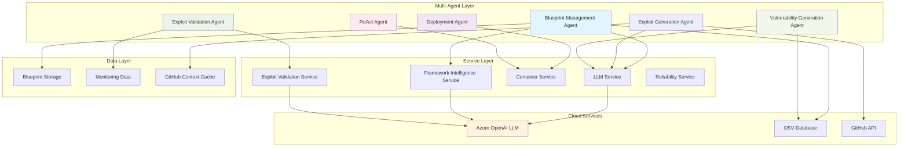

## Multi-Agent Architecture

### Blueprint Management Agent

Orchestrates blueprint creation: queries the OSV database, detects the target framework, selects a POM template, and generates vulnerability code via LLM.

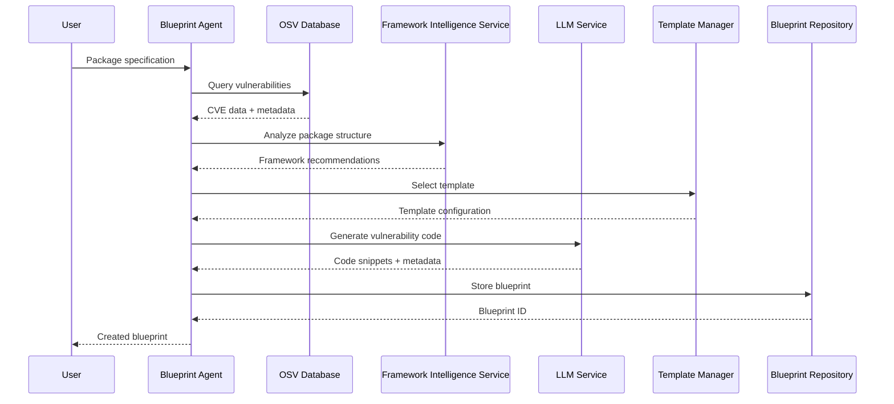

### Deployment Agent

Manages the container lifecycle from build to deployment, with error recovery via the ReAct agent.

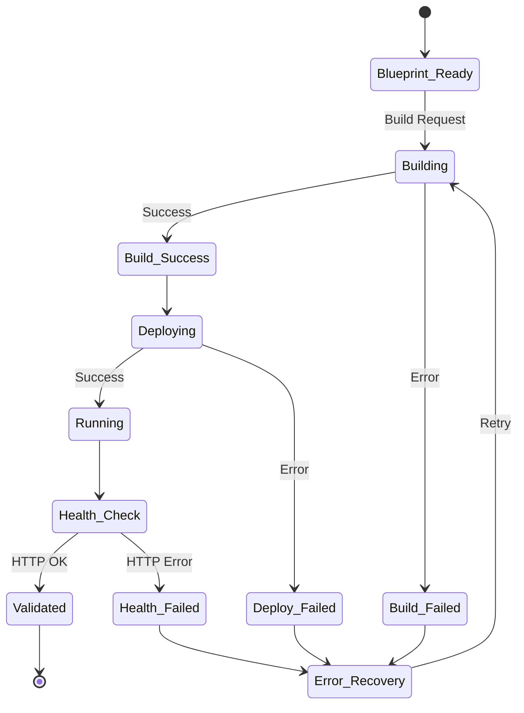

### Exploit Validation Agent

Coordinates validation workflows: decides the validation strategy, manages containers, executes exploit scripts, and enhances results with LLM analysis.


### Exploit Generation Agent

Generates exploit scripts using LLM-driven generation enriched with GitHub context (fix commits, issues, PRs). Analyzes fix diffs to reverse-engineer the vulnerability mechanism.

### Vulnerability Generation Agent

Generates CVE-specific vulnerable Java code and payloads via LLM, integrating extracted PoC data.

### ReAct Agent

Handles error recovery through iterative Reason-Act-Observe cycles. Analyzes build/container failures, proposes fixes using API references, and retries.

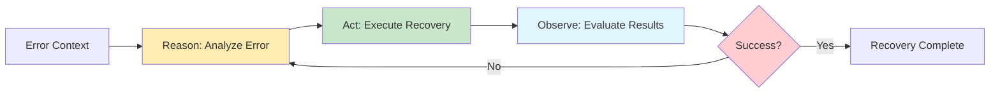

**Integration**: The ReAct Agent works closely with the [Error Recovery Service](../src/services/exploit_validation/error_recovery_service.py) to provide validation failure analysis and corrective action recommendations.

## Prompt Management

The `PromptManager` (`src/utils/core/prompt_manager.py`) loads all prompts from `src/config/prompts/*.yaml`. It supports `{var}` and `${var}` placeholders, validates required variables, and provides version tracking.

### YAML Prompt Structure

```yaml
metadata:
  name: prompt_name
  version: 1.0.0
  description: What this prompt does
  category: prompt_category
  tags:
    - tag1
    - tag2

placeholders:
  required:
    - variable1
    - variable2
  optional:
    - optional_var1

template: |
  Your prompt template here with {variable1} and {variable2}.
  Optional variables: {optional_var1}

examples:
  - description: Example usage
    variables:
      variable1: "value1"
      variable2: "value2"
```

### Available Prompts (22 Total)

| Category | Prompts |
| ---------- | --------- |
| **Blueprint Management** | blueprint_creation, similar_blueprints_analysis, package_description, package_tags |
| **Container Generation** | container_generation, template_customization, dependency_optimization |
| **Exploit Generation** | llm_poc_generation, exploitation_guidance, poc_analysis |
| **Framework Detection** | framework_detection, framework_selection, framework_internal_doc, code_adaptation, version_determination |
| **Validation** | vulnerability_validation, vulnerability_classification, vulnerability_generation, protocol_vulnerability_generation |
| **Error Recovery** | react_reasoning, react_observation, file_regeneration |

---

## Service layer

### Service dependencies

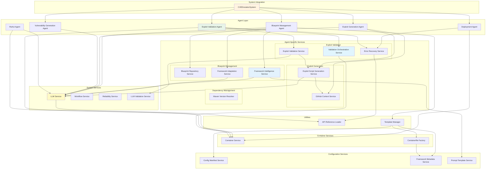

## Service organization

Services follow the `*_service.py` naming convention. Each agent coordinates services within its domain:

- **Blueprint Management Agent** → Framework Intelligence, Framework Adaptation, Blueprint Repository, Template Manager
- **Exploit Validation Agent** → Exploit Validation, Validation Orchestration, Error Recovery
- **Exploit Generation Agent** → Exploit Script Generation, GitHub Context
- **Deployment Agent** → Container Service

## Key services

### APIReferenceLoader

Provides version-specific API guidance during code generation and error recovery. Automatically selects correct imports and patterns based on version ranges (e.g., Struts 6.0-6.3 vs 6.4+).

**Source**: [api_reference_loader.py](../src/utils/api_references/api_reference_loader.py) | Config: [struts_version_apis.yaml](../src/config/api_references/struts_version_apis.yaml), [spring_version_apis.yaml](../src/config/api_references/spring_version_apis.yaml)

```yaml
# struts_version_apis.yaml
"6.0-6.3":  # Matches 6.0.x, 6.1.x, 6.2.x, 6.3.x
  imports:
    - "org.apache.struts2.dispatcher.multipart.UploadedFile"
  example_code: |
    // File upload handling for Struts 6.0-6.3
    private UploadedFile uploadedFile;

"6.4+":     # Matches 6.4.0 and above
  imports:
    - "org.apache.struts2.action.UploadedFilesAware"
  example_code: |
    // File upload handling for Struts 6.4+
    implements UploadedFilesAware
```

### GitHubContextService

Extracts vulnerability context from the GitHub API: issue descriptions, fix commit diffs, and commit classification (fix vs exploit vs reference).

**Source**: [github_context_service.py](../src/services/exploit_generation/github_context_service.py)

### MavenVersionResolver

Validates package versions against Maven Central before builds. Provides fallback strategies (match_major, latest) when OSV returns non-existent versions.

**Source**: [maven_version_resolver.py](../src/services/dependency/maven_version_resolver.py)

### Template Manager

Selects and renders POM templates based on a 3-layer configuration system:

1. **`framework_packages.yaml`** → Classifies packages into groups (framework core, servlet container, application library) with priority ordering for detection
2. **`framework_metadata.yaml`** → Maps `package_pattern` substring rules to specific `.xml` templates per framework, with protocol_type matching for protocol-level servers
3. **`framework_config_manifests.yaml`** → Provides multi-config file references (e.g., `struts.xml`, `web.xml` for Struts) via ConfigManifestService

The resolution flow in `get_pom_template()` (line 621) follows: metadata-driven rule match → framework default template → final fallback to `standalone_jar.xml`.

**Location**: [src/templates/manager.py](../src/templates/manager.py)

### Utilities

- `src/utils/analysis/github_utils.py` -- GitHub classification and filtering
- `src/utils/analysis/github_context_utils.py` -- Context formatting
- `src/utils/analysis/endpoint_utils.py` -- HTTP endpoint metadata extraction

### Configuration files

| File | Purpose |
| --- | --- |
| `framework_packages.yaml` | Package classification (framework core vs library) |
| `supported_packages.yaml` | OSV vulnerability lookup registry |
| `framework_metadata.yaml` | Template selection rules, main class, containerfile config |
| `vulnerability_classification.yaml` | APPLICATION_LEVEL / PROTOCOL_LEVEL / FRAMEWORK_INTERNAL |
| `protocol_detection.yaml` | Protocol type detection (HTTP/2, WebSocket, gRPC) |
| `spring_boot_version_mapping.yaml` | Spring Boot to Spring Framework compatibility |
| `github_classification.yaml` | Commit classification (fix vs exploit vs reference) |

All config files live under `src/config/`.

### Circuit Breaker Pattern Implementation

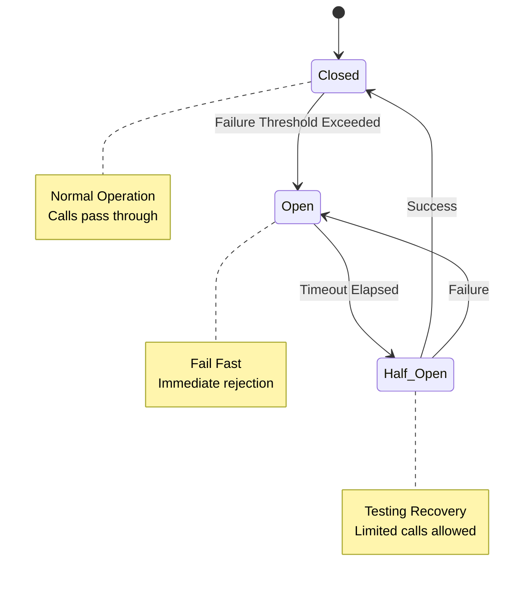

## CWE-to-Vulnerability-Type Mapping System

### Overview

FORGE uses a sophisticated CWE-based classification system to automatically categorize vulnerabilities and select appropriate validation patterns. This system bridges OSV vulnerability data with the framework's validation and exploitation capabilities. Currently, the mapping is done manually but this will be moved to an automated system in the future.

### Classification Flow

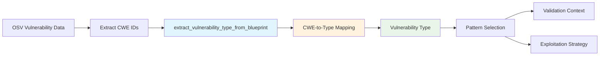

### Supported CWE Mappings

The system maps CWE identifiers to internal vulnerability types for pattern-based validation:

| CWE ID | Vulnerability Type | Description |
| -------- | ------------------- | ------------- |
| CWE-502 | deserialization / yaml_deserialization | Deserialization of Untrusted Data |
| CWE-89 | sql_injection | SQL Injection |
| CWE-78 | command_injection | OS Command Injection |
| CWE-79 | xss | Cross-site Scripting |
| CWE-113 | http_response_splitting | HTTP Response Splitting / Header Injection |
| CWE-611 | xxe | XML External Entity |
| CWE-22 | path_traversal | Path Traversal |
| CWE-400 | dos_attack | Resource Exhaustion |
| CWE-770 | dos_serialization | Serialization-based DoS |
| CWE-94 | code_injection | Code Injection |
| CWE-20 | input_validation | Improper Input Validation |

**Note:** CWE-502 uses package-specific refinement - YAML libraries (e.g., org.yaml:snakeyaml) are classified as `yaml_deserialization` rather than generic `deserialization`.

Classification happens in [src/utils/core/common.py:42-74](../src/utils/core/common.py#L42-L74):

### Pattern Selection Integration

Once classified, the vulnerability type drives pattern selection from [src/config/vulnerability_patterns.yaml](../src/config/vulnerability_patterns.yaml):

```yaml
osv_patterns:
  http_response_splitting:
    - "HTTP response splitting"
    - "CRLF injection"
    - "Header injection"
    - "Content-Disposition"
    - "Reflected File Download"

exploitation_indicators:
  http_response_splitting:
    - "attachment; filename="
    - "Content-Disposition header"
    - "\\r\\n in response"
    - "CRLF sequence detected"

log_patterns:
  http_response_splitting:
    - "header.*injection"
    - "response.*splitting"
    - "filename.*reflected"
```

### Unknown Vulnerability Type Handling

When no CWE mapping exists, the system:

1. Returns `"unknown"` as the vulnerability type
2. Logs a warning: `"No patterns available for vulnerability type: unknown"`
3. Uses generic validation context with lower confidence scores
4. Suggests adding custom CWE mapping in [src/utils/core/common.py](../src/utils/core/common.py)

**Troubleshooting:** See [troubleshooting.md](troubleshooting.md#issue-unknown-vulnerability-type) for handling unmapped CWE IDs.

## GitHub Context-Enhanced Exploitation Pipeline

### GitHub Metadata Integration

The framework uses GitHub metadata to understand vulnerabilities through:

- **GitHub Context Service**: Extracts metadata from issues, fix commits, and pull requests
- **Config-Driven Classification**: Uses `github_classification.yaml` for commit classification
- **Fix Commit Analysis**: Reverse engineering guidance based on what was fixed
- **LLM Context Formatting**: Comprehensive context with fix commits as primary source
- **Generation**: Single LLM-driven path with rich GitHub context

### GitHub Context Extraction Flow

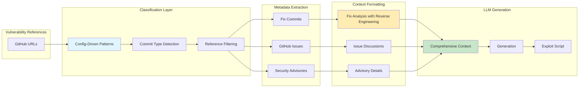

### Config-Driven Classification

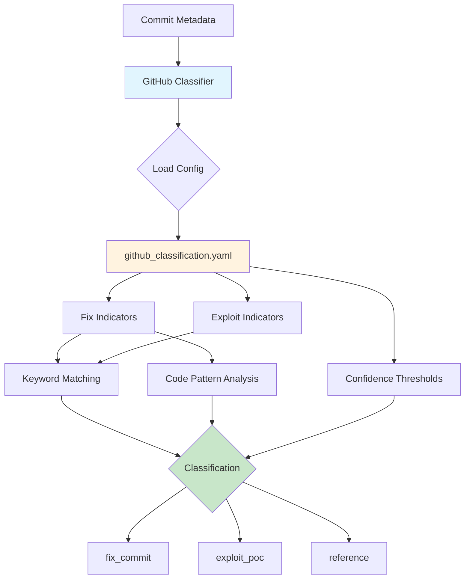

## HTTP-based validation

### Universal web template system

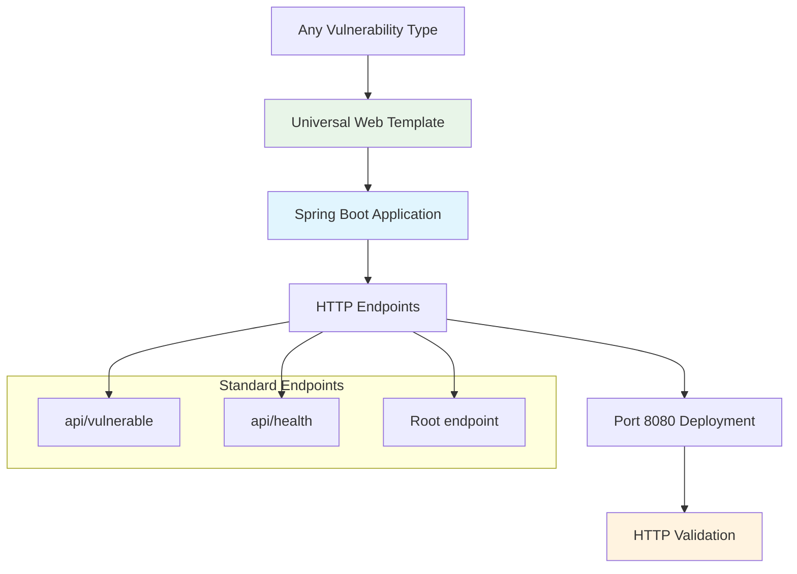

### LLM-based validation contexts

Each vulnerability type has a tailored validation context that guides the LLM in distinguishing successful demonstrations from failures -- replacing hardcoded pattern matching.


#### Supported validation contexts

Defined in [llm_validation_service.py:33-135](../src/services/system/llm_validation_service.py#L33-L135). Coverage for additional types needs further evaluation.

| Context Type | Key Focus | Example Evidence |
| ------------- | ----------- | ------------------ |
| **path_traversal** | Path processing without validation | OS permission errors on /etc/passwd |
| **deserialization** | Object instantiation and class loading | ScriptEngineManager creation |
| **yaml_deserialization** | YAML parsing and object instantiation | Constructor invocation messages |
| **injection** | Command/query execution attempts | SQL/shell syntax errors |
| **rce** | Code execution or process creation | Command output, process spawning |
| **dos_attack** | Resource consumption | OutOfMemoryError, timeout errors |
| **dos_serialization** | Serialization resource exhaustion | Heap exhaustion during processing |
| **http_response_splitting** | Header manipulation | Content-Disposition reflection |
| **xss** | Script injection in responses | `<script>` tag reflection |
| **sql_injection** | SQL query execution | Database syntax errors |
| **command_injection** | OS command execution | Shell error messages |
| **input_validation** | Input processing failures | Validation bypass evidence |

#### Example: HTTP response splitting context

```python
{
    "description": "HTTP response splitting, header injection, and Reflected File Download (RFD) vulnerabilities allow attackers to manipulate HTTP response headers through CRLF injection or unsanitized input reflection in headers like Content-Disposition",

    "analysis_guidance": [
        "CRITICAL: This vulnerability manifests in HTTP RESPONSE HEADERS, not the response body",
        "Check if user-controlled input appears in HTTP response headers (Content-Disposition, Set-Cookie, Location, etc.)",
        "For RFD: Verify if malicious filename is reflected in Content-Disposition header without sanitization",
        "For CRLF injection: Look for carriage return/line feed sequences (\\r\\n or %0d%0a) in response headers",
        "HTTP 200 status with benign body content is expected - focus on header manipulation",
        "Evidence of header injection (e.g., 'attachment; filename=\"malicious.exe\"') indicates successful vulnerability trigger",
        "The vulnerability is triggered if the application reflects user input into headers without proper encoding/sanitization"
    ],

    "key_question": "Did the application reflect user-controlled input into HTTP response headers without proper sanitization, allowing header manipulation?"
}
```

#### Key distinctions

The LLM distinguishes between:

- **Triggered**: App processed malicious input without validation (vulnerable, even if OS blocked exploitation)
- **Exploited**: Full attack chain succeeded
- **Rejected**: App-level validation caught the input (not vulnerable)

For HTTP-based vulnerabilities (RFD, CRLF injection), contexts explicitly direct the LLM to inspect response headers rather than the body.

> **Note**: This methodology is rudimentary; a more sophisticated approach is needed for production use.

All contexts are defined in [llm_validation_service.py](../src/services/system/llm_validation_service.py) (`vulnerability_contexts` dict).

### Container Lifecycle with Validation Orchestration

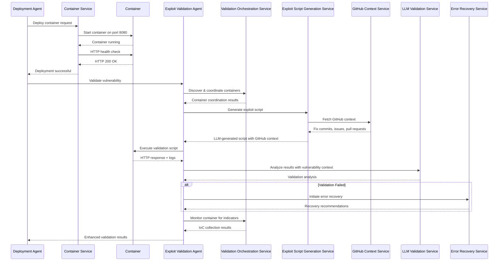

## Data Flow Patterns

### Template-Driven Architecture

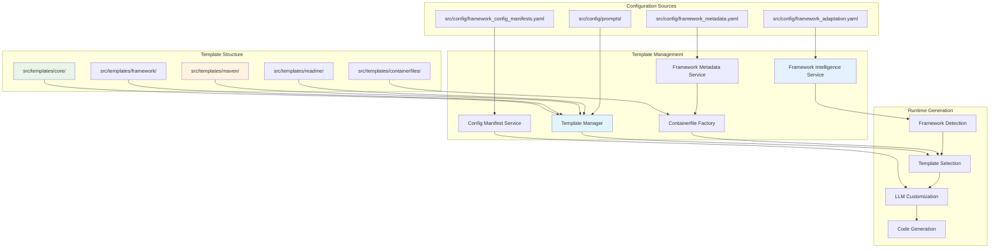

### Error Recovery and Reliability Flow

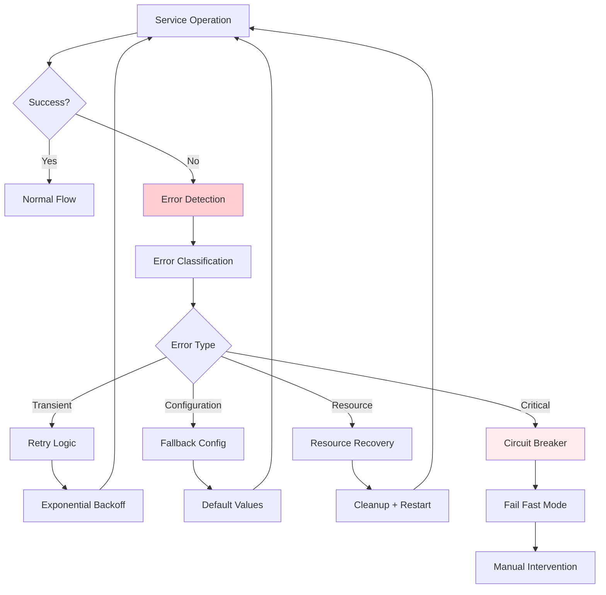

## Reliability

- **Circuit breakers** protect LLM and external service calls
- **Exponential backoff** retries transient failures
- **Graceful degradation** when services are unavailable
- **Intelligent caching** of framework patterns, GitHub metadata (7-day TTL), and LLM responses
- **Config-driven patterns** externalized to YAML for easy updates

## Extending FORGE

### Adding a new framework

1. **`src/config/framework_packages.yaml`**: Add package group classification (e.g., new `<framework>_core_packages` list) and add to `detection_rules.priority_order`
2. **`src/config/supported_packages.yaml`**: Register packages for OSV vulnerability discovery
3. **`src/config/framework_metadata.yaml`**: Add framework entry with `display_name`, `main_class_name`, `base_package`, `containerfile` config, and `template_selection.rules`
4. **`src/config/framework_config_manifests.yaml`**: Add any framework-specific config files (e.g., `struts.xml`, `application.yml`)
5. **`src/templates/core/<template>.xml`**: Create POM template with framework-specific dependencies and build plugins
6. **`src/shared/types.py`**: Extend the `FrameworkType` enum if the framework needs distinct routing in the agent layer
7. **(Optional)** LLM prompt adaptations and API reference files for version-specific guidance
