# FORGE Architecture Documentation

This document provides a comprehensive overview of the FORGE vulnerability research framework architecture, including the multi-agent system, service layers, and data flow patterns.

## System Overview

FORGE implements a multi-agent architecture designed for automated vulnerability research. The system combines AI-powered code generation, real-world PoC integration, and robust reliability patterns.

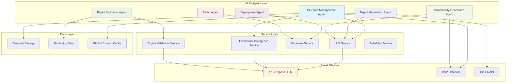

## Multi-Agent Architecture

### Blueprint Management Agent

**Purpose**: Orchestrates vulnerability blueprint creation with intelligent framework detection.

**Key Responsibilities**:

- Package analysis using OSV database integration
- Framework detection via AI-powered pattern matching
- Template selection and customization
- LLM-driven vulnerability code generation

**Data Flow**:

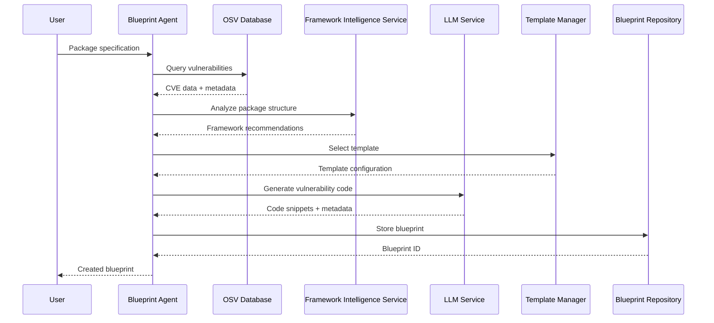

### Deployment Agent

**Purpose**: Manages container lifecycle from build to deployment with error recovery.

**Container Lifecycle Management**:

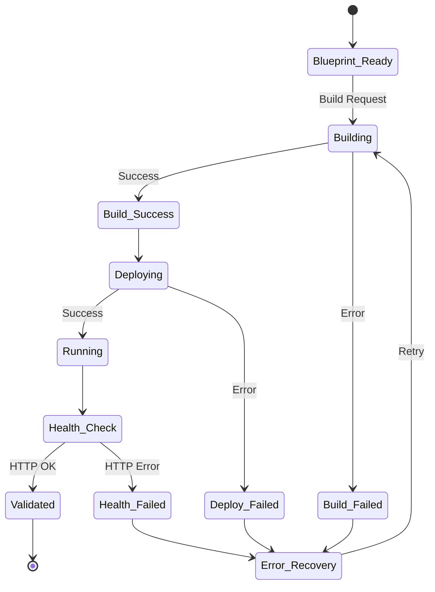

### Exploit Validation Agent

**Purpose**: Strategic coordinator for exploit validation workflows, making decisions about validation approaches and orchestrating multiple services.

**Key Responsibilities**:

- Strategic validation strategy determination
- Container management decision making
- Service coordination and orchestration
- Result enhancement and analysis
- Error recovery coordination

**Validation Strategy Flow**:


### Exploit Generation Agent

**Purpose**: Strategic coordinator for exploit script generation workflows using  LLM-driven generation with GitHub context.

**Key Responsibilities**:

- GitHub metadata extraction and context formatting
- LLM-driven script generation with comprehensive context
- Fix commit analysis and reverse engineering guidance
- Quality enhancement and validation of generated scripts
- Vulnerability mechanism understanding from GitHub discussions

### Vulnerability Generation Agent

**Purpose**: Generates vulnerability-specific code and payloads using LLM-driven techniques.

**Key Responsibilities**:

- CVE-specific vulnerability code generation
- Payload creation and adaptation
- Integration with PoC extraction results
- Context-aware code synthesis

### ReAct Agent

**Purpose**: Specialized agent for intelligent error recovery using iterative reasoning and action cycles.

**Key Responsibilities**:

- Error analysis and recovery strategy planning
- Iterative problem-solving with LLM reasoning
- Container and build error resolution
- Adaptive responses based on observed results

**Reasoning Cycle**:

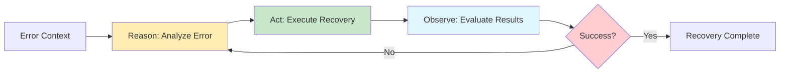

**Integration**: The ReAct Agent works closely with the [Error Recovery Service](../src/services/exploit_validation/error_recovery_service.py) to provide validation failure analysis and corrective action recommendations.

## Prompt Management System

### PromptManager Overview

**Location**: `src/utils/core/prompt_manager.py`

The `PromptManager` provides a centralized, YAML-based prompt management system that replaced 9 different custom prompt loading implementations across the codebase.

**Key Features**:

- **Single Source of Truth**: All prompts loaded from `src/config/prompts/*.yaml`
- **Rich Metadata**: Version tracking, descriptions, categories, examples
- **Variable Validation**: Automatic checking of required vs optional variables
- **Dual Syntax Support**: Handles both `{var}` and `${var}` placeholders
- **Error Handling**: Clear error messages for missing variables or prompts

### YAML Prompt Structure

```yaml
metadata:
  name: prompt_name
  version: 1.0.0
  description: What this prompt does
  category: prompt_category
  tags:
    - tag1
    - tag2

placeholders:
  required:
    - variable1
    - variable2
  optional:
    - optional_var1

template: |
  Your prompt template here with {variable1} and {variable2}.
  Optional variables: {optional_var1}

examples:
  - description: Example usage
    variables:
      variable1: "value1"
      variable2: "value2"
```

### Available Prompts (22 Total)

| Category | Prompts |
| ---------- | --------- |
| **Blueprint Management** | blueprint_creation, similar_blueprints_analysis, package_description, package_tags |
| **Container Generation** | container_generation, template_customization, dependency_optimization |
| **Exploit Generation** | llm_poc_generation, exploitation_guidance, poc_analysis |
| **Framework Detection** | framework_detection, framework_selection, framework_internal_doc, code_adaptation, version_determination |
| **Validation** | vulnerability_validation, vulnerability_classification, vulnerability_generation, protocol_vulnerability_generation |
| **Error Recovery** | react_reasoning, react_observation, file_regeneration |

---

## Service Layer Architecture

### Service Dependencies

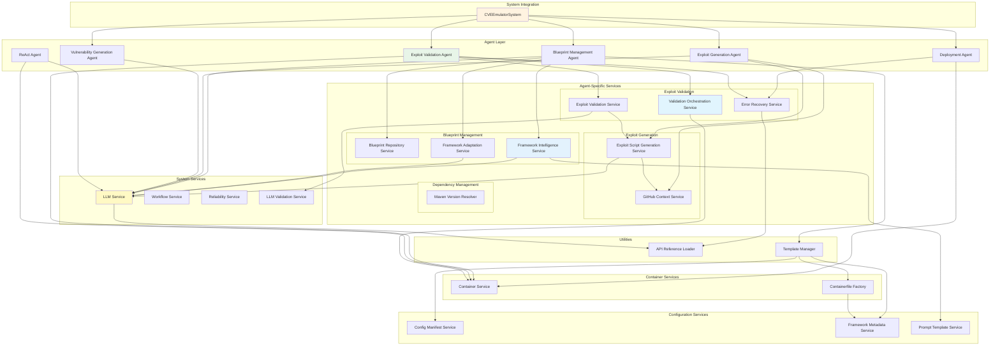

## Service Organization Structure

The services are organized into agent-based folders to improve maintainability and clearly separate responsibilities:

### Service Naming Conventions

All services follow the `*_service.py` naming pattern for consistency. Historical renames include:

- `system_integration.py` → `system_integration_service.py`
- `exploit_script_generator.py` → `exploit_script_generation_service.py`
- Factories use `*_factory.py` pattern (e.g., `containerfile_factory.py`)

### Agent-Service Relationships

Each agent coordinates specific services within its domain:

**Blueprint Management Agent** coordinates:

- Framework intelligence and adaptation decisions
- Blueprint repository operations
- Template selection and customization

**Exploit Validation Agent** coordinates:

- Validation strategy decisions
- Container discovery and orchestration
- Error recovery workflows

**Exploit Generation Agent** coordinates:

- GitHub metadata extraction (issues, fix commits, advisories)
- LLM-driven script generation with comprehensive context
- Script generation and enhancement with fix commit analysis

**Deployment Agent** coordinates:

- Container lifecycle management
- Build and deployment operations

## Key Service Components

### APIReferenceLoader

**Purpose**: Provides version-specific API guidance to LLM during code generation and error recovery.

**Key Features**:

- **Version Range Matching**: Automatically selects correct API patterns based on package version ranges (e.g., "6.0-6.3" matches 6.0.x through 6.3.x)
- **Import Format Handling**: Supports both string and list import formats in YAML configuration
- **Intelligent Caching**: Caches loaded API references in memory for improved performance
- **Framework Detection**: Automatically detects framework (Struts, Spring) from package name
- **LLM Integration**: Injects targeted version-specific guidance into LLM prompts for accurate code generation

**Location**: [src/utils/api_references/api_reference_loader.py](../src/utils/api_references/api_reference_loader.py)

**Configuration Files**:

- [src/config/api_references/struts_version_apis.yaml](../src/config/api_references/struts_version_apis.yaml) - Struts version-specific API guidance
- [src/config/api_references/spring_version_apis.yaml](../src/config/api_references/spring_version_apis.yaml) - Spring version-specific API guidance

**Version Range Configuration Example**:

```yaml
# struts_version_apis.yaml
"6.0-6.3":  # Matches 6.0.x, 6.1.x, 6.2.x, 6.3.x
  imports:
    - "org.apache.struts2.dispatcher.multipart.UploadedFile"
  example_code: |
    // File upload handling for Struts 6.0-6.3
    private UploadedFile uploadedFile;

"6.4+":     # Matches 6.4.0 and above
  imports:
    - "org.apache.struts2.action.UploadedFilesAware"
  example_code: |
    // File upload handling for Struts 6.4+
    implements UploadedFilesAware
```

### GitHubContextService

**Purpose**: Extracts comprehensive vulnerability context from GitHub using API integration.

**Key Features**:

- Full GitHub API integration (replaces HTML scraping)
- Issue descriptions (3000 chars) with maintainer comments
- Smart diff extraction from fix commits
- Commit classification (fix vs exploit)
- Reference filtering and prioritization

**Location**: [src/services/exploit_generation/github_context_service.py](../src/services/exploit_generation/github_context_service.py)

### MavenVersionResolver

**Purpose**: Validates and resolves Maven package versions against Maven Central.

**Key Features**:

- Version existence validation before builds
- Fallback strategies for invalid OSV versions
- Version range resolution (latest, match_major, etc.)
- Maven Central API integration
- Prevents build failures from non-existent versions

**Location**: [src/services/dependency/maven_version_resolver.py](../src/services/dependency/maven_version_resolver.py)

### Template Manager Enhancements

**Purpose**: Intelligent template selection based on package classification.

**Key Features**:

- Package classification (Spring Framework core, Struts core, application libraries)
- Spring Boot version mapping for framework packages
- Dynamic Java version detection (8/11/17/21)
- Framework-specific template routing (WAR vs JAR)
- POM template generation with dependencyManagement overrides

**Location**: [src/templates/manager.py](../src/templates/manager.py)

### Utilities

**New Utility Modules** (v0.4.3):

- `src/utils/analysis/github_utils.py`: GitHub classification and filtering
- `src/utils/analysis/github_context_utils.py`: DRY context formatting
- `src/utils/analysis/endpoint_utils.py`: HTTP endpoint metadata extraction

**Configuration Files**:

- `src/config/framework_packages.yaml`: Package classification
- `src/config/spring_boot_version_mapping.yaml`: Version compatibility mapping
- `src/config/github_classification.yaml`: Commit classification patterns

### Circuit Breaker Pattern Implementation

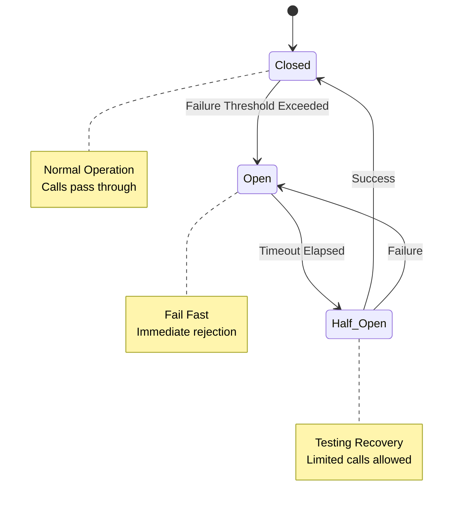

## CWE-to-Vulnerability-Type Mapping System

### Overview

FORGE uses a sophisticated CWE-based classification system to automatically categorize vulnerabilities and select appropriate validation patterns. This system bridges OSV vulnerability data with the framework's validation and exploitation capabilities. Currently, the mapping is done manually but this will be moved to an automated system in the future.

### Classification Flow

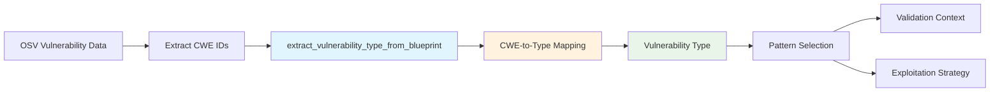

### Supported CWE Mappings

The system maps CWE identifiers to internal vulnerability types for pattern-based validation:

| CWE ID | Vulnerability Type | Description |
| -------- | ------------------- | ------------- |
| CWE-502 | deserialization / yaml_deserialization | Deserialization of Untrusted Data |
| CWE-89 | sql_injection | SQL Injection |
| CWE-78 | command_injection | OS Command Injection |
| CWE-79 | xss | Cross-site Scripting |
| CWE-113 | http_response_splitting | HTTP Response Splitting / Header Injection |
| CWE-611 | xxe | XML External Entity |
| CWE-22 | path_traversal | Path Traversal |
| CWE-400 | dos_attack | Resource Exhaustion |
| CWE-770 | dos_serialization | Serialization-based DoS |
| CWE-94 | code_injection | Code Injection |
| CWE-20 | input_validation | Improper Input Validation |

**Note:** CWE-502 uses package-specific refinement - YAML libraries (e.g., org.yaml:snakeyaml) are classified as `yaml_deserialization` rather than generic `deserialization`.

Classification happens in [src/utils/core/common.py:42-74](../src/utils/core/common.py#L42-L74):

### Pattern Selection Integration

Once classified, the vulnerability type drives pattern selection from [src/config/vulnerability_patterns.yaml](../src/config/vulnerability_patterns.yaml):

```yaml
osv_patterns:
  http_response_splitting:
    - "HTTP response splitting"
    - "CRLF injection"
    - "Header injection"
    - "Content-Disposition"
    - "Reflected File Download"

exploitation_indicators:
  http_response_splitting:
    - "attachment; filename="
    - "Content-Disposition header"
    - "\\r\\n in response"
    - "CRLF sequence detected"

log_patterns:
  http_response_splitting:
    - "header.*injection"
    - "response.*splitting"
    - "filename.*reflected"
```

### Unknown Vulnerability Type Handling

When no CWE mapping exists, the system:

1. Returns `"unknown"` as the vulnerability type
2. Logs a warning: `"No patterns available for vulnerability type: unknown"`
3. Uses generic validation context with lower confidence scores
4. Suggests adding custom CWE mapping in [src/utils/core/common.py](../src/utils/core/common.py)

**Troubleshooting:** See [troubleshooting.md](troubleshooting.md#issue-unknown-vulnerability-type) for handling unmapped CWE IDs.

## GitHub Context-Enhanced Exploitation Pipeline

### GitHub Metadata Integration

The framework uses GitHub metadata to understand vulnerabilities through:

- **GitHub Context Service**: Extracts metadata from issues, fix commits, and advisories
- **Config-Driven Classification**: Uses `github_classification.yaml` for commit classification
- **Fix Commit Analysis**: Reverse engineering guidance based on what was fixed
- **LLM Context Formatting**: Comprehensive context with fix commits as primary source
- **Generation**: Single LLM-driven path with rich GitHub context

### GitHub Context Extraction Flow

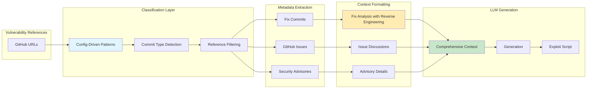

### Config-Driven Classification

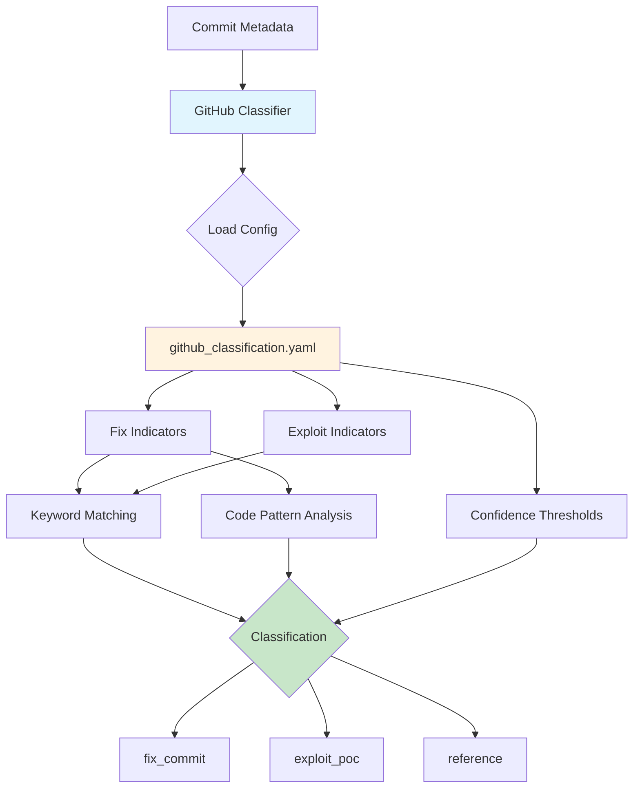

## 🌐 HTTP-Based Validation Architecture

### Universal Web Template System

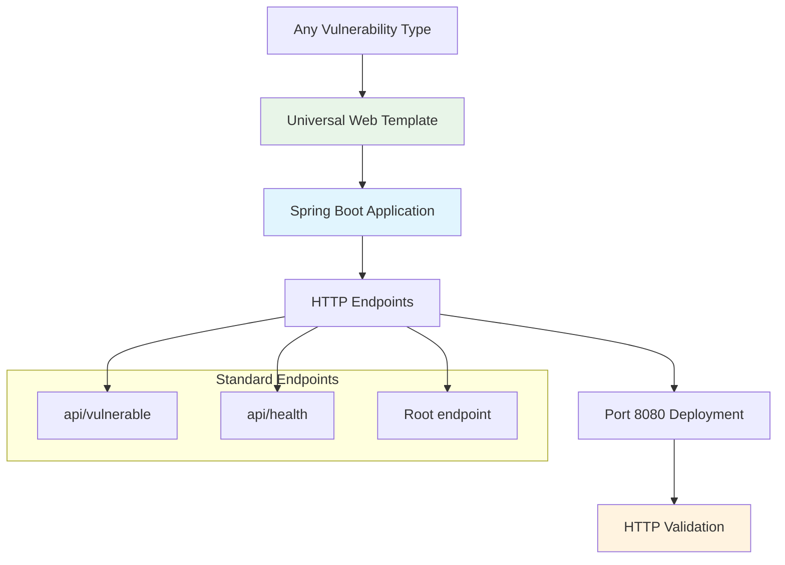

### LLM-Based Validation Contexts

FORGE uses vulnerability-specific validation contexts to provide intelligent, LLM-driven validation instead of hardcoded pattern matching. Each vulnerability type has tailored analysis guidance that helps the LLM understand what constitutes successful demonstration.

#### Context-Driven Validation Flow


#### Supported Validation Contexts (⚠️ Needs further evaluation)

The system provides specialized contexts for 12+ vulnerability types defined in [src/services/system/llm_validation_service.py:33-135](../src/services/system/llm_validation_service.py#L33-L135):

| Context Type | Key Focus | Example Evidence |
| ------------- | ----------- | ------------------ |
| **path_traversal** | Path processing without validation | OS permission errors on /etc/passwd |
| **deserialization** | Object instantiation and class loading | ScriptEngineManager creation |
| **yaml_deserialization** | YAML parsing and object instantiation | Constructor invocation messages |
| **injection** | Command/query execution attempts | SQL/shell syntax errors |
| **rce** | Code execution or process creation | Command output, process spawning |
| **dos_attack** | Resource consumption | OutOfMemoryError, timeout errors |
| **dos_serialization** | Serialization resource exhaustion | Heap exhaustion during processing |
| **http_response_splitting** | Header manipulation | Content-Disposition reflection |
| **xss** | Script injection in responses | `<script>` tag reflection |
| **sql_injection** | SQL query execution | Database syntax errors |
| **command_injection** | OS command execution | Shell error messages |
| **input_validation** | Input processing failures | Validation bypass evidence |

#### Example: HTTP Response Splitting Context

```python
{
    "description": "HTTP response splitting, header injection, and Reflected File Download (RFD) vulnerabilities allow attackers to manipulate HTTP response headers through CRLF injection or unsanitized input reflection in headers like Content-Disposition",

    "analysis_guidance": [
        "CRITICAL: This vulnerability manifests in HTTP RESPONSE HEADERS, not the response body",
        "Check if user-controlled input appears in HTTP response headers (Content-Disposition, Set-Cookie, Location, etc.)",
        "For RFD: Verify if malicious filename is reflected in Content-Disposition header without sanitization",
        "For CRLF injection: Look for carriage return/line feed sequences (\\r\\n or %0d%0a) in response headers",
        "HTTP 200 status with benign body content is expected - focus on header manipulation",
        "Evidence of header injection (e.g., 'attachment; filename=\"malicious.exe\"') indicates successful vulnerability trigger",
        "The vulnerability is triggered if the application reflects user input into headers without proper encoding/sanitization"
    ],

    "key_question": "Did the application reflect user-controlled input into HTTP response headers without proper sanitization, allowing header manipulation?"
}
```

#### Context Benefits

**Intelligent Analysis**: LLM understands the difference between:

- Application-level vulnerability demonstration (✅ Success)
- OS-level exploitation blocking (✅ Still success - vuln triggered)
- Application-level input rejection (❌ Failure - vuln not triggered)

**Header vs Body Distinction**: For HTTP-based vulnerabilities like RFD, the context explicitly guides the LLM to check response headers rather than just the body content.

**Triggered vs Exploited**: The system understands that a vulnerability can be "triggered" (demonstrated) even if full exploitation is blocked by external factors like OS permissions or security controls. **_It is important to note that this methodology is rather rudimentary and a more sophisticated solution needs to be explored_**.

#### Implementation Location

All validation contexts are defined in [src/services/system/llm_validation_service.py](../src/services/system/llm_validation_service.py) within the `vulnerability_contexts` dictionary, which maps each vulnerability type to its description, analysis guidance, and key validation question.

### Container Lifecycle with Validation Orchestration

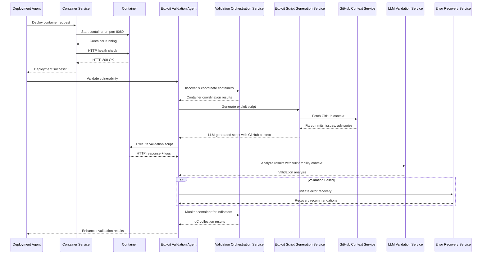

## Data Flow Patterns

### Template-Driven Architecture

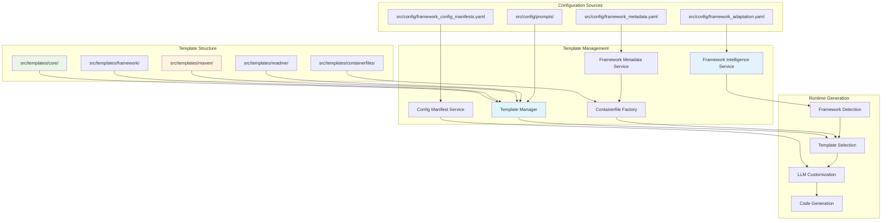

### Error Recovery and Reliability Flow

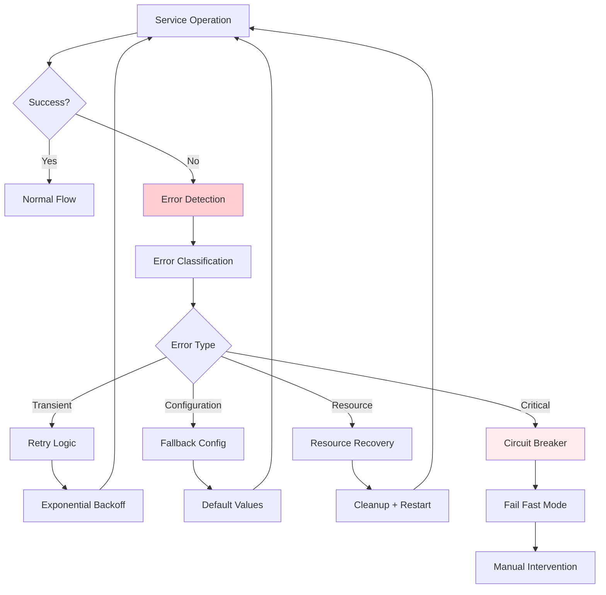

## Architectural Characteristics

### System Scalability

- **Multi-Agent Coordination**: Agents operate with clear separation of concerns
- **Container Isolation**: Each vulnerability demonstration runs in isolated containers
- **Port Management**: Dynamic port allocation prevents conflicts
- **Intelligent Caching**: Framework patterns, GitHub metadata (7-day retention), and LLM responses cached
- **Error Recovery**: ReAct agent provides intelligent error resolution
- **Config-Driven Patterns**: Classification patterns externalized to YAML configs for easy updates

### Reliability Patterns

- **Circuit Breaker**: LLM and external service calls protected by circuit breakers
- **Retry Logic**: Exponential backoff for transient failures
- **Graceful Degradation**: System continues with reduced functionality when services fail
- **Resource Monitoring**: Container and system resource tracking
- **Validation Layers**: Multiple validation stages ensure quality

## Extensibility

### Plugin Architecture

The system supports extensible components:

- **GitHub Metadata Sources**: Easy addition of new metadata extraction sources
- **Classification Patterns**: Config-driven commit classification via `github_classification.yaml`
- **Generation Methods**:  LLM-driven generation with extensible context formatting
- **Execution Environments**: Extensible sandboxing and monitoring
- **Analysis Techniques**: Configurable indicator collection patterns
- **Utility Functions**: Centralized utilities in `utils/analysis/github_utils.py` for reusability

### Framework Addition

Adding new frameworks requires only:

1. Pattern definitions in configuration files
2. Template variants for framework-specific features
3. LLM prompt adaptations for framework characteristics
