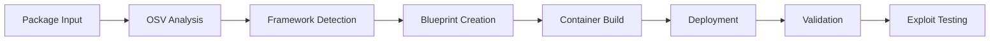

# Getting Started with FORGE

**FORGE** is a PoC-enhanced, multi-agent framework for automated vulnerability research that generates realistic vulnerable applications, deploys them in containers, and validates exploits using real-world Proof-of-Concept (PoC) data.

## 🎯 What You'll Learn

This guide will walk you through:

- Setting up your development environment
- Running your first vulnerability demonstration
- Understanding the basic workflow
- Exploring HTTP-based validation

## 📋 Prerequisites

Before starting, ensure you have:

- **Python 3.12+**
- **Container Runtime**: Docker or Podman
- **Internet Access**: For LLM API calls and PoC extraction

## 🚀 Installation

### Step 1: Clone and Install

```bash
# Clone the repository
git clone https://bitbucket.lab.dynatrace.org/projects/CASP/repos/gyros/browse  
cd gyros

# Install Poetry (if not already installed)
curl -sSL https://install.python-poetry.org | python3 -

# Install dependencies and activate virtual environment
poetry install
poetry shell
```

### Step 2: Configure API Credentials

FORGE requires API credentials for Azure OpenAI. You have two options depending on your deployment:

#### Option A: Local Development (using .env file)

Create a `.env` file in the project root:

```bash
# .env
USE_AWS_SECRETS=false

# Azure OpenAI credentials
AZURE_OPENAI_API_KEY=your-api-key
AZURE_OPENAI_ENDPOINT=https://your-resource.openai.azure.com/
AZURE_OPENAI_DEPLOYMENT=your-deployment-name
AZURE_OPENAI_API_VERSION=2023-05-15

# GitHub token (optional, for enhanced PoC extraction)
GITHUB_TOKEN=your-github-token

# LLM settings
LLM_MODEL=gpt-4
LLM_TEMPERATURE=0.1
LLM_MAX_TOKENS=8000
```

#### Option B: EC2 Deployment (using AWS Secrets Manager)

For secure multi-user EC2 deployments, use AWS Secrets Manager:

1. Create secrets in AWS Secrets Manager (see [AWS Secrets Setup Guide](aws-secrets-setup.md))
2. Configure `.env` on EC2:

```bash
# .env on EC2 instance
USE_AWS_SECRETS=true
AWS_REGION=us-east-1
AWS_SECRETS_NAME=forge/api-keys

# LLM settings (non-secret configuration)
LLM_MODEL=gpt-4
LLM_TEMPERATURE=0.1
LLM_MAX_TOKENS=8000
```

This approach prevents storing API keys in plain text files on shared EC2 instances. See the [complete AWS setup guide](aws-secrets-setup.md) for detailed instructions.

### Step 3: Verify Installation

```bash
# Check system health
python src/main.py health-check

# Validate templates
python src/main.py validate-templates
```

Expected output:

```bash
System Health Status
==================================================
Overall Status: HEALTHY

Template Validation Report  
==================================================
✅ Valid templates found
Success Rate: 100.0%
```

## 🎪 Your First Vulnerability Demonstration

Let's create and test a SnakeYAML deserialization vulnerability:

### Step 1: Generate Vulnerability Blueprint

```bash
# Create a vulnerability blueprint for SnakeYAML
python src/main.py process --packages org.yaml:snakeyaml --limit 1
```

This command:

- Analyzes the `org.yaml:snakeyaml` package using OSV database
- Uses framework intelligence to detect optimal framework (likely Spring Boot)
- Generates vulnerable application code with HTTP endpoints
- Creates a blueprint with metadata and container configuration

### Step 2: Deploy and Validate

```bash
# Complete workflow: blueprint → container → validation
python src/main.py workflow --packages org.yaml:snakeyaml --limit 1 --auto-run --validate
```

This will:

- Build a framework-specific containerized application (Spring Boot/Struts/etc.)
- Deploy it on an available port from range 8080-8090
- Perform HTTP-based validation of vulnerabilities
- Execute PoC-based exploit scripts safely in sandboxed environment

### Step 3: Test the Vulnerable Application

Once deployed, test the vulnerability manually:

```bash
# Check container is running
podman ps

# Test basic connectivity (port may vary - check container output)
curl http://localhost:8080/

# Test the vulnerable endpoint with YAML payload
curl -X POST http://localhost:8080/api/vulnerable \
  -H "Content-Type: text/plain" \
  -d "name: test"
```

Expected response:

> Deserialized object: {name=test}

### Step 4: View Results and Artifacts

```bash
# List generated blueprints
python src/main.py list

# Show details for specific blueprint
python src/main.py details --id <blueprint-id>

# View generated exploit validation
python src/main.py validate-exploit --id <blueprint-id>
```

## 🔧 Servlet Container Testing

FORGE supports testing vulnerabilities in servlet containers themselves:

**Supported Containers:**

- **Undertow**: `io.undertow:undertow-core`
- **Jetty**: `org.eclipse.jetty:jetty-server`
- **Netty**: `io.netty:netty-codec-http`
- **Tomcat Embedded**: `org.apache.tomcat.embed:tomcat-embed-core`

**How It Works:**

Spring Boot selects servlet containers via classpath detection. FORGE automatically:

1. Detects servlet container packages
2. Excludes default Tomcat
3. Includes the target container's Spring Boot starter
4. Deploys with the vulnerable container

**Example:**

```bash
# Test Undertow CVE
poetry run python src/main.py process \
  --packages io.undertow:undertow-core \
  --cve-ids io.undertow:undertow-core:GHSA-95h4-w6j8-2rp8 \
  --auto-run --ports 8080 --validate
```

The container will run with Undertow (not Tomcat), allowing accurate vulnerability testing.

## 🎯 Understanding the Workflow

### Supported Vulnerability Types

FORGE supports 12+ vulnerability types through its CWE-based classification system. Each type has specialized validation contexts and exploitation patterns:

| Vulnerability Type | CWE IDs | Description | Example CVEs |
| ------------------- | --------- | ------------- | -------------- |
| **deserialization** | CWE-502 | Unsafe deserialization of untrusted data | CVE-2022-1471 (SnakeYAML) |
| **yaml_deserialization** | CWE-502 | YAML-specific deserialization | CVE-2022-1471 |
| **sql_injection** | CWE-89 | SQL injection attacks | CVE-2020-XXXXX |
| **command_injection** | CWE-78 | OS command injection | CVE-2021-XXXXX |
| **xss** | CWE-79 | Cross-site scripting | CVE-2023-XXXXX |
| **http_response_splitting** | CWE-113 | Header injection / RFD | CVE-2024-XXXXX |
| **xxe** | CWE-611 | XML External Entity | CVE-2019-XXXXX |
| **path_traversal** | CWE-22 | Directory traversal | CVE-2024-53677 |
| **dos_attack** | CWE-400 | Resource exhaustion | CVE-2022-XXXXX |
| **dos_serialization** | CWE-770 | Serialization-based DoS | CVE-2021-46877 |
| **code_injection** | CWE-94 | Code injection | CVE-2020-XXXXX |
| **input_validation** | CWE-20 | Input validation bypass | CVE-2023-XXXXX |

**Key Features:**

- **Intelligent Validation**: Each vulnerability type has specialized LLM validation contexts that understand the difference between triggered vulnerabilities (successful demonstration) and blocked exploitation (OS/security controls)
- **Header-Based Detection**: HTTP-based vulnerabilities (CWE-113) properly validate response headers rather than just body content
- **Pattern-Based Classification**: Automatic detection from OSV vulnerability data using CWE IDs
- **Extensible Architecture**: Easy to add new CWE mappings in [src/utils/core/common.py](../src/utils/core/common.py)

**Adding Custom Vulnerability Types:**

See [troubleshooting.md](troubleshooting.md) for detailed instructions on extending the system with new CWE mappings.

### Multi-Agent Architecture

FORGE uses several intelligent agents and services:

1. **Blueprint Management Agent**: Creates vulnerability blueprints using framework intelligence
2. **Deployment Agent**: Manages container build, deployment, and health monitoring
3. **Vulnerability Generation Agent**: Handles vulnerability code generation
4. **Exploit Validation Agent**: Manages exploit script validation and execution with error recovery
5. **Exploit Generation Agent**: Coordinates PoC-enhanced and LLM-driven exploit script generation
6. **ReAct Agent**: Handles complex reasoning and adaptive responses
7. **Framework Intelligence Service**: Detects optimal frameworks for vulnerabilities
8. **Framework Adaptation Service**: Adapts code to specific framework patterns
9. **LLM Validation Service**: Context-aware validation using intelligent reasoning instead of pattern matching
10. **Error Recovery Service**: Analyzes validation failures and suggests corrective actions
11. **API Reference Loader**: Provides version-specific API guidance for accurate code generation

### Integrated Workflow Pipeline



The system:

- Analyzes packages using OSV vulnerability database
- Uses framework intelligence for optimal framework selection
- Generates framework-specific vulnerable applications
- Builds and deploys containers with proper isolation
- Validates vulnerabilities through HTTP endpoints
- Executes PoC scripts safely in sandboxed environment

### LLM Validation Contexts

FORGE uses intelligent, context-aware validation instead of hardcoded pattern matching. Each vulnerability type has a specialized validation context that guides the LLM in understanding:

**Key Concepts:**

- **Triggered vs Exploited**: The system understands that a vulnerability can be "triggered" (demonstrated) even if full exploitation is blocked by OS permissions or security controls
- **Application Behavior vs External Factors**: Distinguishes between application-level security (good) and OS-level blocking (still vulnerable)
- **Header vs Body**: For HTTP-based vulnerabilities, the system checks response headers (Content-Disposition, Set-Cookie, Location) rather than just body content

**Example: Path Traversal**:

- ✅ **Success**: Application processes `../../etc/passwd` path, but OS denies access with "Permission denied"
- ❌ **Failure**: Application rejects path with "Invalid filename" validation error

**Example: HTTP Response Splitting (CWE-113)**:

- ✅ **Success**: Malicious filename reflected in `Content-Disposition: attachment; filename="malicious.exe"`
- ❌ **Failure**: HTTP 200 with safe body content only (headers not checked)

See [architecture.md#llm-based-validation-contexts](architecture.md#llm-based-validation-contexts) for complete context list.

### API Reference System

FORGE provides version-specific API guidance for accurate code generation across framework versions:

**Key Features:**

- **Version Range Matching**: Automatically selects correct APIs for Struts 6.0-6.3 vs 6.4+, Spring Framework 5.x vs 6.x
- **Import Guidance**: Provides framework-specific imports (e.g., `UploadedFile` vs `UploadedFilesAware` for Struts)
- **Example Code**: Shows version-appropriate implementation patterns
- **LLM Integration**: Injects targeted guidance into code generation prompts

**Example:**

```bash
# Struts 6.2.0 uses different file upload APIs than 6.4.0
# System automatically provides correct imports and patterns
python src/main.py process --packages org.apache.struts:struts2-core --limit 1
# → Generates code with version 6.2.0-appropriate APIs
```

**Implementation:** See [src/utils/api_references/api_reference_loader.py](../src/utils/api_references/api_reference_loader.py) and [src/config/api_references/](../src/config/api_references/) for API reference configurations.

### HTTP-Based Validation

All vulnerabilities are demonstrated via standardized HTTP endpoints:

- **`/api/vulnerable`**: Primary vulnerability demonstration endpoint
- **`/api/parse`**: Parser-specific vulnerability testing
- **`/api/exploit`**: Specific exploitation endpoints
- **`/health`**: Container health and status checks

## 🔧 Common Commands

### Blueprint Management

```bash
# List available blueprints
python src/main.py list

# Filter blueprints by package name
python src/main.py list --filter snakeyaml

# Show blueprint details
python src/main.py details --id <blueprint-id>

# Regenerate code for a blueprint
python src/main.py regenerate --id <blueprint-id>

# Show blueprint statistics
python src/main.py stats
```

### Container Operations

```bash
# Build and run container from blueprint
python src/main.py container --id <blueprint-id> --auto-run

# Run with custom port range
python src/main.py container --id <blueprint-id> --auto-run --ports 8080-8090

# Run in background with validation
python src/main.py container --id <blueprint-id> --auto-run --validate --background

# Stop all running containers
python src/main.py stop-all
```

### Framework-Specific Testing

Default packages: `org.yaml:snakeyaml`, `net.sf.ehcache:ehcache`, `com.google.guava:guava`

```bash
# Test with Spring Boot framework
python src/main.py workflow --packages org.springframework:spring-core --framework-type spring-boot --auto-run

# Test with Apache Struts framework  
python src/main.py workflow --packages org.apache.struts:struts2-core --framework-type struts --auto-run --validate

# Test with Micronaut framework (reactive microservices)
python src/main.py workflow --packages com.fasterxml.jackson.core:jackson-databind --framework-type micronaut --auto-run

# Test with Jenkins plugin framework
python src/main.py process --packages org.jenkins-ci.plugins:some-plugin --framework-type jenkins

# Note: All frameworks are web-based HTTP applications for consistent testing
```

### Advanced CLI Options

```bash
# Debug mode with detailed logging
python src/main.py --debug workflow --packages org.yaml:snakeyaml --auto-run

# Disable LLM-based container generation
python src/main.py --no-llm process --packages org.springframework:spring-core

# Enable LLM enhancements for exploitation
python src/main.py --enable-llm-enhancements workflow --packages org.yaml:snakeyaml --validate

# Custom LLM timeout (default: 30 seconds)
python src/main.py --llm-timeout 60 process --packages com.fasterxml.jackson.core:jackson-databind

# Specify additional Maven dependencies
python src/main.py process --packages org.yaml:snakeyaml --additional-deps com.example:custom-lib:1.0

# Target specific CVE IDs
python src/main.py process --packages org.yaml:snakeyaml --cve-ids org.yaml:snakeyaml:CVE-2022-1471
```

## 🛡️ Safety and Security

### Container Isolation

- **Network Isolation**: Containers run on isolated networks  
- **Resource Limits**: CPU, memory, and process constraints
- **Port Management**: Automatic port allocation from configurable ranges (default: 8080-8090)
- **Container State Tracking**: Automatic cleanup and state management

### Script Execution Safety

- **Sandboxed Environment**: 30-second timeout, 256MB memory limit for exploit scripts
- **Module Whitelisting**: Only safe Python modules allowed in validation environment
- **Pattern Blocking**: Prevents dangerous operations (subprocess, eval, file system access)
- **Network Isolation**: Exploit validation runs in isolated network context

## 🎓 Next Steps

Now that you have FORGE running:

1. **Explore Architecture**: Read [architecture.md](architecture.md) for system design details
2. **Review Examples**: See [examples.md](examples.md) for real-world scenarios
3. **Troubleshooting**: See [troubleshooting.md](troubleshooting.md) for common issues

## 🆘 Need Help?

- **Troubleshooting Guide**: See [troubleshooting.md](troubleshooting.md) for comprehensive troubleshooting
- **Architecture Details**: Check [architecture.md](architecture.md) for complete system documentation
- **CLI Reference**: Run `python src/main.py --help` to see all available commands

---

Explore the full documentation in the [docs/](.) folder or run `python src/main.py --help` to see all available commands.
