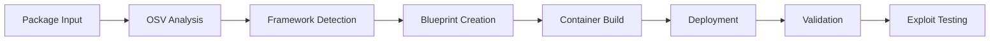

# Getting Started

FORGE is a multi-agent framework for automated vulnerability research. It generates vulnerable Java applications from real CVE data, deploys them in containers, and validates exploits using proof-of-concept payloads.

## Prerequisites

- **Python 3.12+**
- **Docker or Podman**
- **Internet access** for LLM API calls and PoC extraction

## Installation

### 1. Clone and install

```bash
git clone git@github.com:dynatrace-oss/forge.git
cd forge

# Install Poetry if needed
curl -sSL https://install.python-poetry.org | python3 -

poetry install
poetry shell
```

### 2. Configure credentials

FORGE requires Azure OpenAI credentials. Create a `.env` file in the project root:

```bash
USE_AWS_SECRETS=false

AZURE_OPENAI_API_KEY=your-api-key
AZURE_OPENAI_ENDPOINT=https://your-resource.openai.azure.com/
AZURE_OPENAI_DEPLOYMENT=your-deployment-name
AZURE_OPENAI_API_VERSION=2023-05-15

# Optional: improves PoC extraction from GitHub
GITHUB_TOKEN=your-github-token

LLM_MODEL=gpt-4
LLM_TEMPERATURE=0.1
LLM_MAX_TOKENS=8000
```

For shared EC2 deployments, use AWS Secrets Manager instead of plain-text `.env` files. See the [AWS Secrets Setup Guide](aws-secrets-setup.md).

### 3. Verify installation

```bash
python src/main.py health-check
python src/main.py validate-templates
```

## Quick start

Generate and validate a SnakeYAML deserialization vulnerability end-to-end:

```bash
# Blueprint only
python src/main.py process --packages org.yaml:snakeyaml --limit 1

# Full pipeline: blueprint → container → validation
python src/main.py workflow --packages org.yaml:snakeyaml --limit 1 --auto-run --validate
```

Once running, test the vulnerable endpoint:

```bash
curl -X POST http://localhost:8080/api/vulnerable \
  -H "Content-Type: text/plain" \
  -d "name: test"
# → Deserialized object: {name=test}
```

View results:

```bash
python src/main.py list
python src/main.py details --id <blueprint-id>
```

## Servlet container testing

FORGE can test vulnerabilities in servlet containers directly. Supported containers:

| Container | Packages |
|-----------|----------|
| Undertow | `io.undertow:undertow-core` |
| Jetty | `org.eclipse.jetty:jetty-server`, `jetty-http`, `jetty-webapp` |
| Netty | `io.netty:netty-codec-http`, `netty-codec-http2` |
| Tomcat | `org.apache.tomcat.embed:tomcat-embed-core`, `org.apache.tomcat:tomcat-coyote` |
| Vert.x | `io.vertx:vertx-core` |

Spring Boot selects containers via classpath detection. FORGE automatically excludes the default Tomcat and includes the target container's starter:

```bash
poetry run python src/main.py process \
  --packages io.undertow:undertow-core \
  --cve-ids io.undertow:undertow-core:GHSA-95h4-w6j8-2rp8 \
  --auto-run --ports 8080 --validate
```

## Vulnerability types

FORGE classifies vulnerabilities using CWE IDs and applies type-specific validation:

| Type | CWE | Description |
|------|-----|-------------|
| `deserialization` | CWE-502 | Unsafe deserialization |
| `sql_injection` | CWE-89 | SQL injection |
| `command_injection` | CWE-78 | OS command injection |
| `xss` | CWE-79 | Cross-site scripting |
| `http_response_splitting` | CWE-113 | Header injection / RFD |
| `xxe` | CWE-611 | XML external entity |
| `path_traversal` | CWE-22 | Directory traversal |
| `dos_attack` | CWE-400 | Resource exhaustion |
| `code_injection` | CWE-94 | Code injection |
| `input_validation` | CWE-20 | Input validation bypass |

Each type has specialized LLM validation contexts that distinguish between a vulnerability being *triggered* (app processed malicious input) versus *exploited* (full attack chain succeeded). See [architecture.md](architecture.md#llm-based-validation-contexts) for details.

## Architecture overview

FORGE uses 6 agents coordinating 15+ services:

| Agent | Role |
|-------|------|
| Blueprint Management | Framework detection, template selection, code generation |
| Deployment | Container build and lifecycle management |
| Vulnerability Generation | CVE-specific vulnerable code via LLM |
| Exploit Generation | Payload generation with GitHub context (fix commits, issues, PRs) |
| Exploit Validation | Validation orchestration and LLM-based analysis |
| ReAct Error Recovery | Iterative reasoning-and-action error resolution |



All vulnerabilities are demonstrated via HTTP endpoints (`/api/vulnerable`, `/health`, `/api/parse`).

## CLI reference

### Blueprint management

```bash
python src/main.py list                          # List blueprints
python src/main.py list --filter snakeyaml       # Filter by package
python src/main.py details --id <id>             # Show details
python src/main.py regenerate --id <id>          # Regenerate code
python src/main.py stats                         # Statistics
```

### Container operations

```bash
python src/main.py container --id <id> --auto-run
python src/main.py container --id <id> --auto-run --ports 8080-8090
python src/main.py container --id <id> --auto-run --validate --background
python src/main.py stop-all
```

### Framework targeting

```bash
python src/main.py workflow --packages org.springframework:spring-core --framework-type spring-boot --auto-run
python src/main.py workflow --packages org.apache.struts:struts2-core --framework-type struts --auto-run --validate
python src/main.py workflow --packages com.fasterxml.jackson.core:jackson-databind --framework-type micronaut --auto-run
```

### Advanced options

```bash
python src/main.py --debug workflow --packages org.yaml:snakeyaml --auto-run
python src/main.py --llm-timeout 60 process --packages com.fasterxml.jackson.core:jackson-databind
python src/main.py process --packages org.yaml:snakeyaml --cve-ids org.yaml:snakeyaml:CVE-2022-1471
python src/main.py process --packages org.yaml:snakeyaml --additional-deps com.example:custom-lib:1.0
```

## Safety

**Container isolation**: Containers run on isolated networks with CPU, memory, and process limits. Ports are allocated automatically from configurable ranges (default 8080-8090).

**Script sandboxing**: Exploit scripts execute with a 30-second timeout and 256MB memory limit. Only whitelisted Python modules are allowed; dangerous operations (`subprocess`, `eval`, filesystem access) are blocked.

## Next steps

- [Architecture](architecture.md) -- system design and data flow
- [Examples](examples.md) -- real-world vulnerability scenarios
- [Troubleshooting](troubleshooting.md) -- common issues and solutions
- `python src/main.py --help` -- full CLI reference
